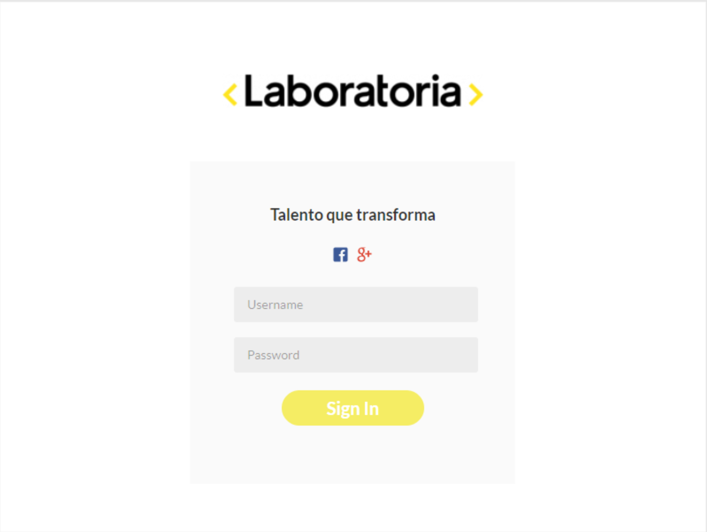
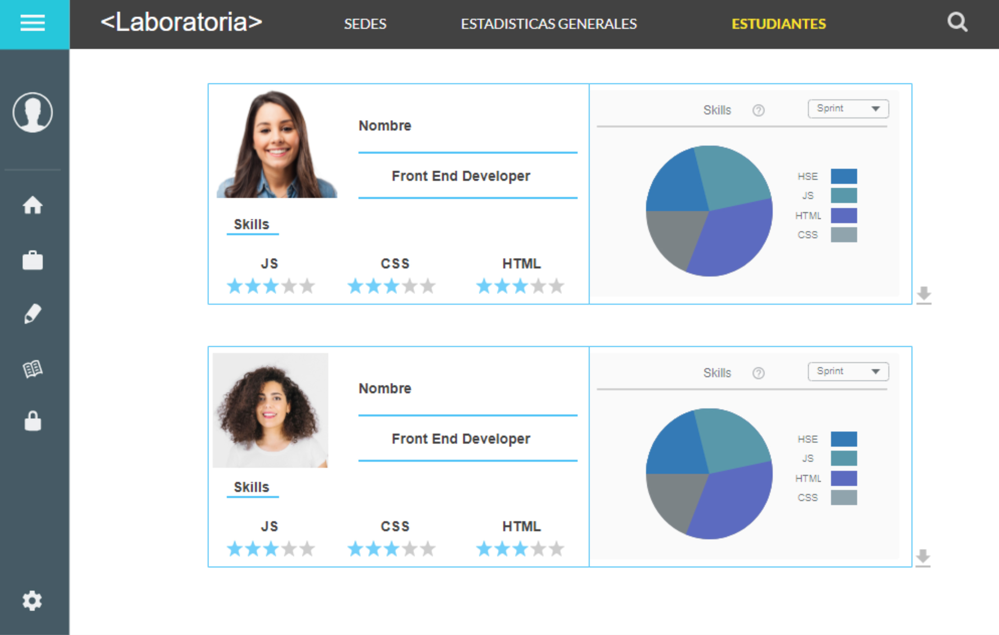
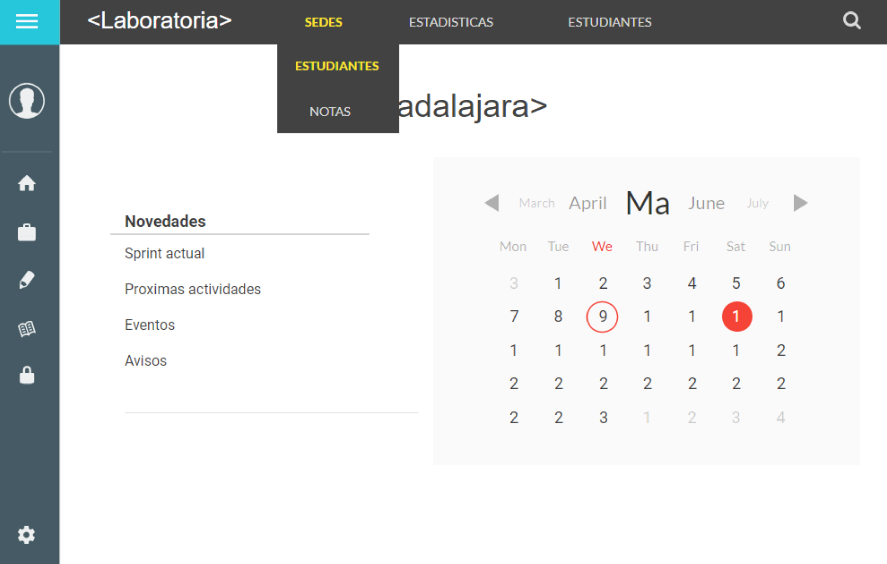
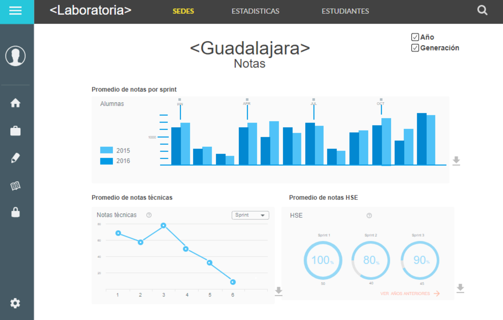

# Reto Data DashBoard

###  Reto de código

En este reto de código se deberá desarrollar una herramienta para que los Training Manager de todas las sedes de laboratoría puedan acceder a la informacion de manera rapida y concisa. Se pretende que puedan acceder a los datos por generación y sede.

En esta primera parte se deberá entregar un repositorio de Github que contenga un archivo README en el cual se expondrá toda la documentación y el proceso de diseño de experiencia del usuario que se siguió para obtener la solución del reto.

### Consideraciones Específicas

En el Data Dashboard se debe poder consultar de manera eficaz los siguientes datos:

1. Número de estudiantes inscritas.

2. Número de estudiantes que desertaron.

3. Número y porcentaje de estudiantes que pasan el criterio mínimo de evaluación.

4. Promedio final de notas por sprint.

5. Promedio de notas HSE.

6. Promedio de notas técnicas.

## Producto UX Data Dashboard

### Investigación

Se detecta una problemática en Laboratoría, donde los Training Manager no cuentan con una herramienta para recuperar la información relacionada con las alumnas de manera eficaz.
Mediante una investigación se identificó que utilizan un sistema obsoleto en el cual la manipulación de datos es lenta y tediosa.

### Resultados de entrevistas

Se realizaron encuestas y entrevistas con las Training Manager de diferentes sedes.
Las respuestas mas significativas y de mayor peso para nuestro proyecto fueron las siguientes:

 - "Todo está en excel, entonces si quieres ver la data consolidada y ponerla en perspectiva con otro resultado/indicador toma mucho tiempo y no es muy agil."

 - "Una plataforma o una herramienta web conectada a la data y que genere los resultados automaticamente."

 - "Que no está centralizada, son varios archivos con información distinta y es pesado a veces revisar todo para tener una idea general del estatus de las estudiantes."

 - "Filtros y gráficas que me resuman la información."

 - "Es un poco estresante porque hay presión de tiempo para tener todo listo y poder entregar a las estudiantes el feedback que necesitan."

En base a esta informacíon detectamos que las principales problemáticas a mejorar son:

1. La información se encuentra descentralizada y la búsqueda es manual.

2. El tiempo invertido en cotejar diferentes bases de datos es muy alto.

3. No cuentan con gráficos que permitan visualizar y comparar la información de manera eficaz.

### Hipótesis

Consideramos que la principal problemática que tienen las Training Managers de Laboratoría es la dispersión de la información y el manejo de la misma de manera manual.
Esto les impide trabajar de manera ágil y obtener resultados concretos.
Por esta razon los TM invierten mucho tiempo en localizar datos específicos como por ejemplo la información por estudiante, unidad, sprint, promedio, etc.

#### Definición de problema

 Mediante el análisis de las respuestas obtenidas de las entrevistas y encuestas realizadas a las Training Manager Llegamos a la conclusión de que necesitan una herramienta amigable que ayude a la recopilacion, analisis y representacion de datos ya que todas ellas mencionan esto. Utilizamos postit para anotar las ideas principales que detectamos así como compartir lo que cada una de nosotras logro concluir.

#### Lluvia de ideas.

#### Propuesta de solución.

#### Sketching y Prototyping
¿Cómo un data dashboard resuelve las necesidades de las clientes?
Para esto generamos un pequeño video con una historia de usuario:

[Historia de usuario](https://www.powtoon.com/c/bjknz65hmC5/0/m)

Y realizamos el Mockup detallando el flujo de nuestra aplicación:

## Producto Data Dashboard

### Objetivo

Producto mínimo viable que cubra las necesidades de los Training Manager para recuperar la información relacionada con las alumnas de manera eficaz, en menos tiempo y obteniendo datos precisos.

### Resultados

Página web de fácil navegación. Cuenta con una barra de menú que muestra la fotografía del usuario, estadísticas, sedes y couches.
    a)	Estadísticas: Muestra la información de las estudiantes de toda Laboratoria por sede. Esto permite obtener los datos globales desde que se ingresa a la página.

    b)	Sedes: Muestra otra sección con las sedes actuales. Al dar clic sobre la imagen de la sede se muestran los datos por generación y en gráficas de la cantidad de estudiantes activas, porcentaje de estudiantes no activas y quienes son,  cantidad y porcentaje de estudiantes exitosas en general, por HSE y Tech. Los datos aparecen pasando el puntero por las barras.

    c)	Couches: Muestra las gráficas de la puntuación promedio de profesores y jedis por sede y generación.

### Propuesta de valor

La propuesta de valor de nuestro producto es:

1.	Estadísticas generales que se muestran en la primera sección que incluyen la información por sede.

2.	Menos clics para llegar a los datos. Tan solo se requieren 7 clics para leer toda la información.

### Trabajo en proceso
Se continúa trabajando en:
1.	Página de inicio para entrar con usuario y contraseña

2.	Grafica que muestre la cantidad y porcentaje de estudiantes exitosas por generación, HSE y tech.

3.	Descarga de información.
